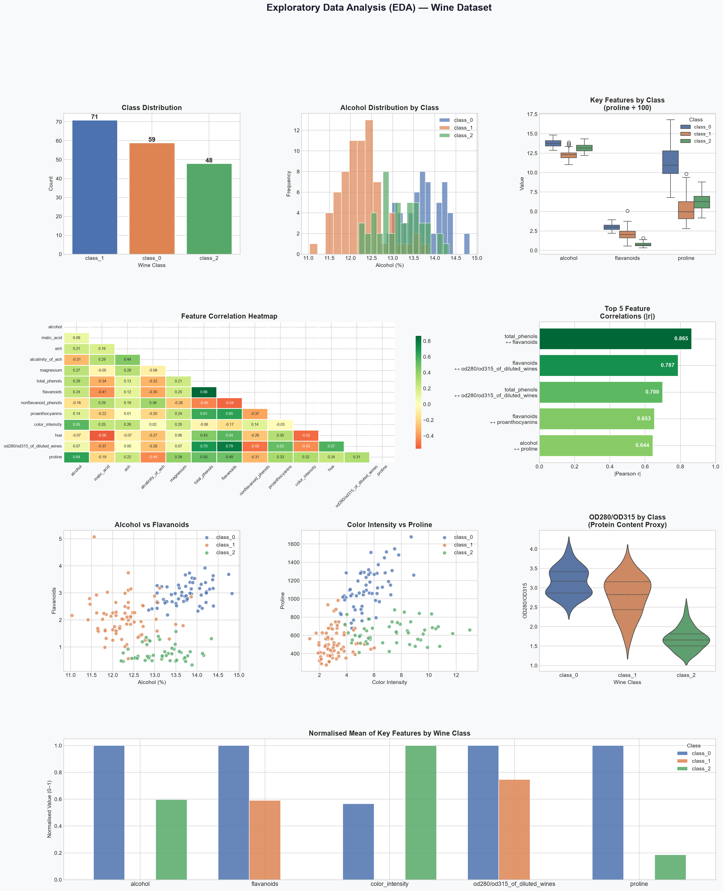

# eda-wine-analysis
EDA on Wine dataset — statistical summaries, correlation heatmaps, and pattern discovery using Python &amp; Seaborn
# 🍷 Exploratory Data Analysis (EDA) — Wine Dataset

> Analyze a dataset to uncover patterns and trends using statistical summaries and visualizations.

---

## 📌 About
This project performs a full EDA on the Wine dataset (178 samples, 13 features) to uncover patterns, correlations, and key influencing factors across 3 wine classes.

## 📊 Dataset
| Property | Details |
|---|---|
| Source | `sklearn.datasets` — Wine (UCI) |
| Samples | 178 |
| Features | 13 chemical properties |
| Target | class_0 / class_1 / class_2 |

## 🔍 Key Findings
- **Flavanoids** are the strongest class separator
- **Total Phenols ↔ Flavanoids** correlation: r = 0.865
- **class_0** has the highest alcohol (13.7%) and proline (1115)
- 4 features alone can predict wine class with high accuracy

## 📈 Visualizations


## 🛠️ Tech Stack
`Python` `Pandas` `NumPy` `Matplotlib` `Seaborn` `Scikit-learn`

## ▶️ How to Run
```bash
pip install pandas numpy matplotlib seaborn scikit-learn
python eda_project.py
```

## 📁 Project Structure
📦 eda-wine-analysis

┣ 📜 eda_project.py       # Main EDA script

┣ 📊 eda_report.png       # Output visualization

┗ 📄 README.md
